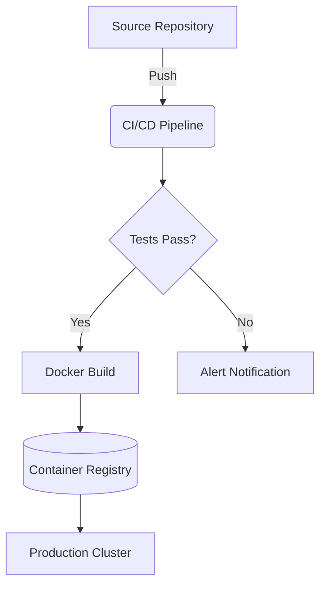

# 🚀 System Architecture & API Documentation

> Welcome to the comprehensive technical documentation for our new microservices architecture.

## 1. Mathematical Models (KaTeX)

The system relies on complex predictive models to balance load across nodes. The fundamental equation governing node distribution is:

$$
f(x) = \int_{-\infty}^\infty \hat{f}(\xi)\,e^{2 \pi i \xi x} \,d\xi
$$

For inline calculations, we use $E = mc^2$ to approximate energy costs.

---

## 2. Infrastructure Flow (Mermaid Diagram)

Below is the automated CI/CD pipeline visualizing how code travels from GitHub to Production.



---

## 3. API Endpoints

| Method   | Endpoint    | Description              | Auth Required  |
| -------- | ----------- | ------------------------ | -------------- |
| `GET`    | `/v1/users` | Fetch all active users   | ✅ Yes         |
| `POST`   | `/v1/login` | Authenticate and get JWT | ❌ No          |
| `DELETE` | `/v1/nodes` | Remove a cluster node    | ✅ Yes (Admin) |

## 4. Code Implementation

```typescript
// Core load balancer logic
export function distributeLoad(nodes: Node[], traffic: number): boolean {
  if (nodes.length === 0) throw new Error('No active nodes');
  
  const payloadPerNode = traffic / nodes.length;
  console.log(`Distributing ${payloadPerNode} req/s...`);
  
  return true;
}
```
